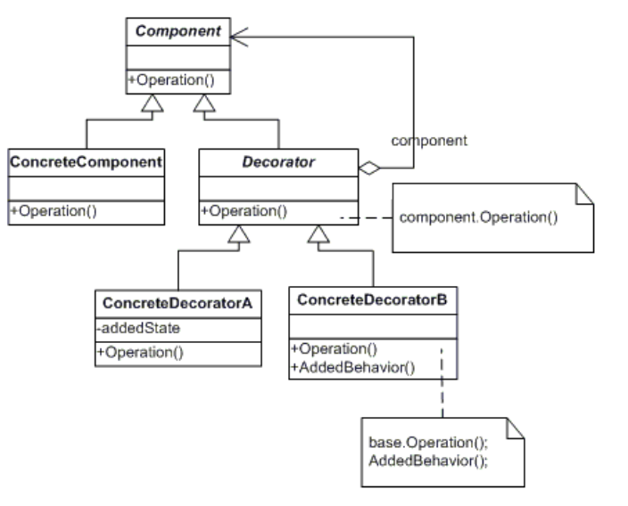

# Decorator 装饰者模式

## 解决的问题：
Decorator模式可以在不修改原有对象外观、功能以及继承关系的情况下动态地扩展一些对象功能， 这样就在不使用静态继承的情况下，为修改对象功能提供了灵活的选择。
它是通过创建一个包装对象，也就是装饰来包裹真实的对象。

典型的场景：
我们在装饰新家的时候买了几幅抽象画，买回来之后发现有些加上色彩艳丽的边框更适合我们，而有的加上玻璃罩之后更能符合我们的使用。那我们来怎么解决这个问题呢？那就是装饰者模式。

## 类图以及说明:

在装饰模式中的各个角色有：

* 抽象构件（Component）角色：给出一个抽象接口，以规范准备接收附加责任的对象。

* 具体构件（Concrete Component）角色：定义一个将要接收附加责任的类。

* 装饰（Decorator）角色：持有一个构件（Component）对象的实例，并定义一个与抽象构件接口一致的接口。

* 具体装饰（Concrete Decorator）角色：负责给构件对象"贴上"附加的责任。

## 装饰者与适配者模式的区别：
1.关于新职责：适配器也可以在转换时增加新的职责，但主要目的不在此。装饰者模式主要是给被装饰者增加新职责的。

2.关于原接口：适配器模式是用新接口来调用原接口，原接口对新系统是不可见或者说不可用的。装饰者模式原封不动的使用原接口，系统对装饰的对象也通过原接口来完成使用。（增加新接口的装饰者模式可以认为是其变种--“半透明”装饰者）

3.关于其包裹的对象：适配器是知道被适配者的详细情况的（就是那个类或那个接口）。装饰者只知道其接口是什么，至于其具体类型（是基类还是其他派生类）只有在运行期间才知道。

## 要点：
1． 装饰者和被装饰对象有相同的超类型。

2． 可以用一个或多个装饰者包装一个对象。

3． 装饰者可以在所委托被装饰者的行为之前或之后，加上自己的行为，以达到特定的目的。

4． 对象可以在任何时候被装饰，所以可以在运行时动态的，不限量的用你喜欢的装饰者来装饰对象。

5． 装饰模式中使用继承的关键是想达到装饰者和被装饰对象的类型匹配，而不是获得其行为。

6． 装饰者一般对组件的客户是透明的，除非客户程序依赖于组件的具体类型。在实际项目中可以根据需要为装饰者添加新的行为，做到“半透明”装饰者。

## 适用场景：
在以下情况下应当使用装饰模式：

**1. 需要扩展一个类的功能，或给一个类增加附加责任。**

**2. 在不影响其他对象的情况下, 需要动态地给一个对象增加功能，这些功能可以再动态地撤销。**

**3. 无法通过静态子类来实现扩展，可能需要增加由一些基本功能的排列组合而产生的非常大量的功能增加，子类数量膨胀。另一种情况可能是因为类定义被隐藏，或类定义不能用于生成子类。**

## 优缺点
优点：
1. Decorator模式与继承关系的目的都是要扩展对象的功能，但是Decorator可以提供比继承更多的灵活性。可以用添加和分离的方法，用装饰在运行时刻增加和删除职责。

2. 通过使用不同的具体装饰类以及这些装饰类的排列组合，设计师可以创造出很多不同行为的组合。

缺点：
1. 这种比继承更加灵活机动的特性，也同时意味着更加多的复杂性。

2. 装饰模式会导致设计中出现许多小类，如果过度使用，会使程序变得很复杂。

3. 装饰模式是针对抽象组件（Component）类型编程。但是，如果你要针对具体组件编程时，就应该重新思考你的应用架构，以及装饰者是否合适。当然也可以改变Component接口，增加新的公开的行为，实现“半透明”的装饰者模式。在实际项目中要做出最佳选择。

1) 比静态继承更灵活： 与对象的静态继承（多重继承）相比， Decorator模式提供了更加灵活的向对象添加职责的方式。可以用添加和分离的方法，用装饰在运行时刻增加和删除职责。相比之下，继承机制要求为每个添加的职责创建一个新的子类。这会产生许多新的类，并且会增加系统的复杂度。此外，为一个特定的Component类提供多个不同的 Decorator类，这就使得你可以对一些职责进行混合和匹配。使用Decorator模式可以很容易地重复添加一个特性。
2) 避免在层次结构高层的类有太多的特征 Decorator模式提供了一种“即用即付”的方法来添加职责。它并不试图在一个复杂的可定制的类中支持所有可预见的特征，相反，你可以定义一个简单的类，并且用 Decorator类给它逐渐地添加功能。可以从简单的部件组合出复杂的功能。这样，应用程序不必为不需要的特征付出代价。同时更易于不依赖于 Decorator所扩展（甚至是不可预知的扩展）的类而独立地定义新类型的 Decorator。扩展一个复杂类的时候，很可能会暴露与添加的职责无关的细节。
3) Decorator与它的Component不一样 Decorator是一个透明的包装。如果我们从对象标识的观点出发，一个被装饰了的组件与这个组件是有差别的，因此，使用装饰不应该依赖对象标识。
4) 有许多小对象 采用Decorator模式进行系统设计往往会产生许多看上去类似的小对象，这些对象仅仅在他们相互连接的方式上有所不同，而不是它们的类或是它们的属性值有所不同。尽管对于那些了解这些系统的人来说，很容易对它们进行定制，但是很难学习这些系统，排错也很困难。
